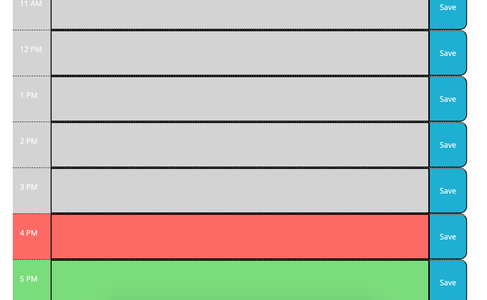

# dayplanner
Create a dynamic day planner using HTML, CSS and Javascript. The current date is displayed at the top
of the page using a function created using moment.js. The user can input items in their planner and
save them to their schedule. This saves items to local storage. When the page refreshes, the items stay there.
Additionally, time blocks are color coded based on time of day. If the time is in the past the blocks are grey,
if the time is in the future they are green and the present time block is shown in red.

Repository URL: https://github.com/jordanmorse/dayplanner
Page URL: https://jordanmorse.github.io/dayplanner/

